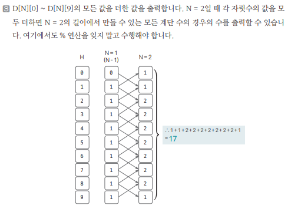

[링크](https://www.acmicpc.net/problem/10844)

## 1. 문제 분석

ex) 45656 => 인접한 모든 자릿수 차이가 1이다. 이러한 숫자를 `계단 수`라고 한다. 

길이가 N인 계단수가 총 몇개가 있는지 구하는 프로그램을 작성하시오. (0으로 시작하는 수는 없다)

--- 

만약 N번째 길이에서 5로 끝나는 계단 수가 있었을 때 이 계단 수의 N-1자리에 올 수 있는 숫자는 4 또는 6이다. 

그러면 다음과 같이 정의할 수 있다.
```
D[N][H] : 길이가 N인 계단에서 높이 H로 종료되는 계단 수를 만들 수 있는 경우의 수
```

## 2. 손으로 풀어보기 

1. 각 자리수에는 0~9가 위치한다. 

- N번째 자리에서 계단 높이가 0일 때 => N-1번째 자리는 높이가 1이어야 한다
- N번째 자리에서 계단 높이가 9일 때 => N-1번째 자리는 높이가 8이어야 한다
- N번째 자리에서 계단 높이가 0과 9가 아닌 H일 때 => N-1번째 자리는 높이가 H+1 또는 H-1이어야 한다.

```
D[i][H] = D[i-1][H+1] # H = 0일 때 
D[i][H] = D[i-1][H-1] # H = 9일 때
D[i][H] = D[i-1][H+1] + D[i-1][H-1] # H가 1~8일 때
```

2. DP 테이블 초기화

각 높이에서 길이가 1인 계단 수는 모두 1가지이므로 1로 초기화한다.   
0으로 계단수가 시작할 수는 없으므로 이때는 0으로 초기화한다.

```
D[1][0] = 0, D[1][1] = 1, D[1][2] = 1, D[1][3] = 1, D[1][4] = 1, 
D[1][5] = 1, D[1][6] = 1, D[1][7] = 1, D[1][8] = 1, D[1][9] = 1
```



## 3. 슈도코드 

``` 
N : 숫자 길이
D[N][H] : 길이가 N일 때 높이 H로 끝나는 계단 수의 모든 경우의 수 

for i -> 1~N : 
    D[1][i] = 1 # 길이가 1일 때 만드는 높이 H로 끝나는 계단 수의 모든 경우의 수는 1가지 

for i -> 2~N : 
    D[i][0] = D[i-1][1] # N번째 자리에서 높이가 0이면 N-1번재 자리에서는 높이가 1이어야 계단 수 가능
    D[i][9] = D[i-1][8] # N번째 자리에서 높이가 9이면 N-1번재 자리에서는 높이가 8이어야 계단 수 가능

    for h in range(1, 9) : 
        D[i][h] = D[i-1][h+1] + D[i-1][h-1] 

        나온 결과는 1,000,000,000

sum : 출력할 결과값 

for i in range(0, 10) : 
    sum += D[N][i]

print(sum)
```

[코드](../../code/day27/88_계단수구하기.py)