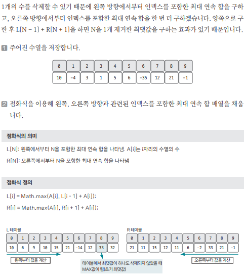
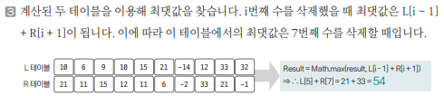

[링크](https://www.acmicpc.net/problem/13398)

## 1. 문제 분석

N개의 정수로 이뤄진 임의의 수열이 주어진다.  
주어진 수열에서 연속된 몇 개의 수를 선택해 구할 수 있는 합 중 가장 큰 합을 구하려고 한다.

단, 숫자를 1개 이상 선택해야 하고 숫자를 1개 제거할 수 있다.

ex) 10 -4 3 1 5 6 -35 12 21 -1

- 아무런 숫자를 제거하지 않았다면 12, 21만 선택해서 33이 정답이다. 
- `-35`를 제거한다면 10 -4 3 1 5 6 12 21를 선택해서 54가 정답이 된다.

--- 

- DP에서 점화식을 정의할 때 가장 흔히 하는 실수 

DP에서는 큰 문제를 작은 문제로 나눌 수 있고 이러한 작은 문제들을 해결해서 큰 문제를 해결한다. 

위 문제에서는 수열에서 가장 큰 합을 구하려고 할 때 수열에서 숫자 1개를 제거할 수 있다고 했다. 

그러면 다음과 같이 점화식을 정의할 수 있다. 

```
D[N] : 0 ~ N까지의 길이에서 연속으로 수를 선택해서 구할 수 있는 최대 합
```

하지만, 이 점화식은 잘못됐다.  
왜냐하면, 큰 문제를 부분 문제로 나눴을 때 부분 문제는 큰 문제를 해결하기 위한 1개의 부분이 되어야 한다는 것에 위배되기 때문이다.

좀 더 풀어서 말하면 위 정의에서는 N값이 명확하지 않다. 

ex) 10 -4 3 1 5 6 -35 12 21 -1

잘못된 점화식을 이용했을 때 D[3] = 10 ==> 맨 앞에 있는 숫자 10을 선택한 후 아무것도 선택하지 않는 게 가장 큰 값이기 때문이다.

하지만, D[0],D[1],D[2],D[3] 모두 10이라는 걸 알 수 있다. 

즉, D[N]에서 N값은 문제를 부분 문제로 나누는데 적절치 못한 정의가 되어 있다는 걸 알 수 있다. 그렇다면, 어떻게 N값을 정의해야 할까?

- 적절한 점화식 정의
```
D[N] : 0~N까지의 길이에서 N을 포함하며 연속으로 수를 선택하여 구할 수 있는 최대 합
```

위와 같이 점화식을 정의하면 좀 더 쉽게 부분 문제를 이용해 전체 문제를 해결할 수 있다. 

이처럼 DP에서 점화식을 정의할 때는 `테이블의 인덱스`가 큰 문제를 적절하게 작은 문제로 분리할 수 있는지를 고려해야 한다.

## 2. 손으로 풀어보기 





L[5] + R[7] = 리스트의 6번째 ~ 8번째 숫자 중에서 7번째 값을 제외한 합 

## 3. 슈도코드 

``` 
N : 수열 크기 
A : 수열 데이터를 저장하는 리스트
L : 왼쪽에서 오른쪽으로 index를 포함한 최대 연속 합을 나타내는 테이블
R : 오른쪽에서 왼쪽으로 index를 포함한 최대 연속 합을 나타내는 테이블

for i -> 1~N : 
    L[i] = max(A[i], L[i-1] + A[i]) # 왼쪽 합 리스트 저장 
    L 리스트의 최댓값을 정답 변수에 저장 # 이 값은 숫자를 삭제하지 않았을 때 최댓값이 된다

for i -> N-2 ~ 0 : 
    R[i] = max(A[i], R[i+1] + A[i]) # 오른쪽 합 리스트 저장 

for i -> 1 ~ N-1 : 
    기존 정답 변수값과 L[i-1] + R[i+1]로 계산한 값 중 더 큰 값을 고른다
    # L[i-1] + R[i+1] = (0번째 부터 시작하는) 리스트의 i-1~i+1번째 값의 연속 합에서 i번째 값을 삭제했을 때 최댓값 

print(최댓값)
```

[코드](../../code/day27/89_연속된정수합구하기.py)