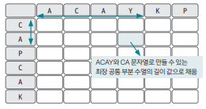
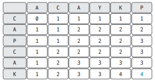
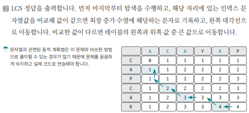

[링크](https://www.acmicpc.net/problem/9252)

## 1. 문제 분석

LCS(Longest Common Subsequence) : 두 수열이 주어졌을 때 모두의 부분 수열이 되는 수열 중 가장 긴 것을 찾는 문제 

ex) ACAYKP, CAPCAK의 LCS => ACAK 

--- 

LCS는 문자열을 이용한 대표적인 DP 문제다.  
이 문제를 해결하기 위해서는 아래와 같이 문자열을 축으로 하는 `2차원 리스트`를 생성해야 한다.



위와 같이 구성한 2차원 리스트가 점화식 테이블이 된다. 

테이블에 저장하는 값은 각 위치 인덱스를 마지막 문자로 하는 두 문자열의 최장 공통 수열의 길이다. 

ex) 위 그림에서 표시한 부분 
- ACAYKP에서 Y를 마지막 문자로 하는 문자열 ACAY
- CAPCAK에서 A를 마지막 문자로 하는 문자열 CA

해당 위치에는 두 문자열의 최장 공통 수열의 길이를 저장한다.

## 2. 손으로 풀어보기 

1. LCS 점화식을 이용해 값을 채운다. 

- 특정 자리가 가리키는 행과 열의 문자열 값이 `일치`하는 경우 
```
DP[i][j] = DP[i-1][j-1] + 1 # 테이블의 대각선 왼쪽 위의 값에 1을 더한 값을 저장

# 두 문자열을 비교할 때
# 문자열1[i] == 문자열2[j]가 성립하니까 
# (이전까지의 공통 길이) + 1 을 해주면 된다.
# 이전까지의 공통 길이란 DP[i-1][j-1]을 의미한다.
```

- 특정 자리가 가리키는 행과 열의 문자열 값이 `불일치`하는 경우 

```
DP[i][j] = Math.max(DP[i-1][j], DP[i][j-1]) 

# 어차피 두 문자열에서 문자열1[i] != 문자열2[j]가 성립한다.
# 그러면 문자열1의 0~(i-1) 부분과 문자열2의 0~j 부분의 LCS와 
# 그러면 문자열1의 0~i 부분과 문자열2의 0~(j-1) 부분의 LCS를 비교해서 
# 더 큰 값을 저장해야 한다.
```

위에서 만든 점화식을 이용해서 테이블을 채우면 다음과 같이 나타낼 수 있다.  
LCS의 길이는 4라는 걸 알 수 있다.





## 3. 슈도코드 

``` 
A : 1번째 문자열 
B : 2번째 문자열 
DP : 2차원 점화식 테이블 
Path : LCS 저장 리스트

for i -> 1~A 길이 반복 : 
    for j -> 1~B 길이 반복 : 
        A[i]와 B[j]가 같으면 DP[i][j]의 값을 왼쪽 대각선 값 + 1로 저장
        그렇지 않으면 왼쪽 값, 위의 값 중 큰 값으로 DP[i][j] 저장 

DP의 마지막 값 출력(LCS 길이)

getText(row, column) : 

    if A[row]와 B[column]이 같다면 : 
        LCS에 기록 & 대각선 왼쪽 위로 이동

    else : 
        왼쪽 값과 위의 값 중 더 큰 쪽으로 이동

LCS 문자열 출력
```

[코드](../../code/day27/90_최장공통부분수열찾기.py) 