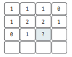
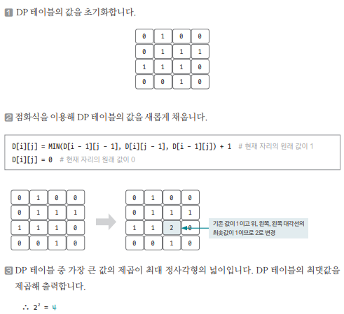

[링크](https://www.acmicpc.net/problem/1915)

## 1. 문제 분석

크기가 n * m이고 0과 1로만 이뤄진 배열이 있다.  
이 배열에서 1로만 이뤄진 가장 큰 정사각형의 크기를 구하는 프로그램을 작성하자.

--- 

가장 큰 정사각형의 넓이를 구하는 건 가장 큰 정사각형의 한 변의 길이를 구하는 것과 같은 얘기다. 

따라서 변의 길이를 다음과 같이 D[i][j]로 정의한 후에 문제를 풀어보자.

```
D[i][j] : i, j 위치를 오른쪽 아래 꼭짓점으로 정하고, 해당 자리에서 그릴 수 있는 가장 큰 정사각형의 변의 길이 
```



위 그림에서 물음표 위치의 원래 값이 1일 경우 

해당 위치에서 위, 왼쪽, 대각선 왼쪽 위에 있는 값 중 가장 작은 값에 1을 더한 값으로 변경한다. (해당 위치가 오른쪽 아래 꼭짓점인지 파악하기 위해서 위, 왼쪽, 대각선 왼쪽 위를 살펴봐야 한다)

원래 값이 0이라면 그대로 둔다. 

## 2. 손으로 풀어보기 



## 3. 슈도코드 

``` 
D[i][j] : (i, j) 위치에서 왼쪽 위로 만들 수 있는 최대 정사각형 길이를 저장하는 리스트 

N : 리스트의 세로 길이
M : 리스트의 가로 길이
max : 최댓값

for i를 N만큼 반복 : 
    numbers : 데이터를 한 줄씩 저장하는 리스트 

    for j를 M만큼 반복 : 
        D[i][j]에 number[j]값을 저장 

        if D[i][j]의 값이 1이면 : 
            자신의 위, 왼쪽, 대각선 위의 값 중 최소값 + 1 저장 
        
        if D[i][j]의 값이 최댓값보다 크면 : 
            최댓값 업데이트

print(최댓값 * 최댓값) # 정사각형의 넓이
```

[코드](../../code/day28/91_가장큰정사각형찾기.py)