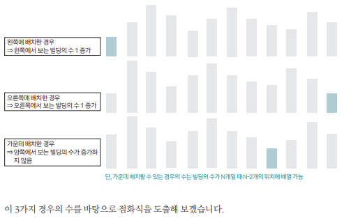
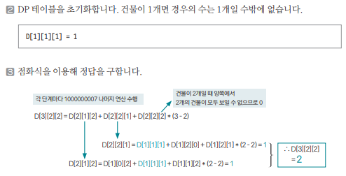

[링크](https://www.acmicpc.net/problem/1328)

## 1. 문제 분석

빌딩 N개가 1줄로 세워져 있다.   
모든 빌딩의 높이는 1보다 크거나 같고 N보다 작거나 같으며 높이가 같은 빌딩은 없다. 

이때, 가장 왼쪽에서 볼 수 있는 빌딩의 개수 L, 가장 오른쪽에서 볼 수 있는 빌딩 개수를 R이라고 할 때 가능한 빌딩 순서의 경우의 수를 구하는 프로그램을 작성하시오.

(N의 최댓값 100)

ex. N = 5, L = 3, R = 2 => 가능한 빌딩 배치 중 하나 1 3 5 2 4

왼쪽에서는 1, 3, 5 3개가 보이고 오른쪽에서는 4, 5 2개가 보이기 때문이다.

--- 

점화식을 정의해보자

```
D[N][L][R] : N개의 빌딩이 있고 왼쪽에서 L개, 오른쪽에서 R개가 보이는 게 가능한 경우의 수 
```

점화식을 적절히 정의하고 나면 이 문제를 어떻게 단순화할 수 있을지 생각해야 한다. 

1. N-1개 빌딩과 관련된 모든 경우의 수를 알고 있다고 가정   
2. 이후 1개의 빌딩을 어느 곳에 배치할 것인지를 결정하는 것이 관건이다  

- 배치하는 빌딩이 가장 큰 빌딩이라고 하자  
==> 가장 왼쪽 또는 가장 오른쪽에 배치할 때 보이는 빌딩은 1개다  
==> 중간에 배치하면? 빌딩이 얼마나 보일 지 예측할 수 없다.

이 시점에서 관점을 다르게 가져가야 한다.  

높이가 애매한 빌딩을 일정한 규칙에 따라 배치해 단순화해 볼 수 있지 않을까? 라는 가정을 추가해보자.

가장 작은 빌딩을 N번째로 배치한다고 가정해보자. 그러면 다음과 같이 3가지 경우의 수가 발생한다.



## 2. 손으로 풀어보기 

앞서 정의한 점화식 

```
D[N][L][R] : N개의 빌딩이 있고 왼쪽에서 L개, 오른쪽에서 R개가 보이는 게 가능한 경우의 수 
```

상황에 따른 점화식을 구해보자.

N개의 빌딩이 왼쪽에 L개, 오른쪽에 R개가 보인다고 가정하면

1) N-1개의 빌딩에서 왼쪽에 빌딩을 추가하면 왼쪽에서 보이는 빌딩이 1개 증가한다. 따라서 이전 경우의 수는 다음과 같다.
```
D[N-1][L-1][R]
```

2) N-1개의 빌딩에서 오른쪽에 빌딩을 추가하면 오른쪽에서 보이는 빌딩이 1개 증가한다. 따라서 이전 경우의 수는 다음과 같다.
```
D[N-1][L][R-1]
```

3) N-1개의 빌딩에서 가운데에 빌딩을 추가할 때 보이는 빌딩이 늘어나지는 않지만 N-2개의 위치에서 배치할 수 있으므로 (N-2)를 곱한다.
```
D[N-1][L][R] * (N-2)
```

3가지 경우의 수를 모두 더하면 다음과 같은 점화식이 나온다.

```
D[N][L][R] = D[N-1][L-1][R] + D[N-1][L][R-1] + D[N-1][L][R] * (N-2)
```



## 3. 슈도코드 

``` 
D[N][L][R] : 빌딩 N개를 왼쪽에서 L개, 오른쪽에서 R개가 보이도록 배치할 수 있는 모든 경우의 수 

D[1][1][1] = 1 # 건물이 1개일 때 배치될 경우의 수는 1가지 

for i -> 2~N : 
    for j -> 1~L : 
        for k -> 1 ~ R : 
            D[i][j][k] = 
                D[i-1][j][k] * (i-2) + 
                D[i-1][j][k-1] + 
                D[i-1][j-1][k]

                나온 결과를 1,000,000,007로 나눈 나머지 연산 수행 

print(D[N][L][R])
```

[코드](../../code/day28/92_빌딩순서구하기.py)