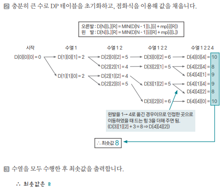

[링크](https://www.acmicpc.net/problem/2342)

## 1. 문제 분석

발판 1개를 중점으로 위, 아래, 왼쪽, 오른쪽으로 연결되어 있다.  
편의상 중점을 0, 위를 1, 왼쪽을 2, 아래를 3, 오른쪽을 4라고 칭한다.

- 게임 규칙

1. 처음에는 두 발을 중앙에 모은다. 
2. 게임이 시작하면 왼쪽 또는 오른쪽 발을 움직인다.   
    - 이때, 두 발이 동시에 움직이면 안 된다. 
    - 게임을 시작했을 때를 제외하고는 두 발이 같은 지점에 있어서는 안 된다.

발이 움직이는 위치에 따라 필요한 힘이 다르다. 

- 중앙 => 다른 지점 : 힘 2 사용
- 다른 지점 => 인접한 지점 : 힘 3 사용  
    ex) 2 => 1 또는 3을 이동할 때 힘 3 사용 

- 다른 지점 => 반대편 지점 : 힘 4 사용  
    ex) 2 => 4 : 힘 4 사용 

- 같은 지점을 한 번 더 누르면 힘 1 사용

예제) 1 → 2 → 2 → 4를 눌러야 한다

1. 처음에는 (0, 0)에 위치 (왼발 위치 0, 오른발 위치 0)
2. (0, 0) → (0, 1) → (2, 1) → (2, 1) → (2, 4) 순서로 발을 움직여야 한다.
    - (0, 0) → (0, 1) : 오른발을 위로 1칸 / 힘 2 소요 
    - (0, 1) → (2, 1) : 왼발을 왼쪽으로 1칸 / 힘 2 소요 
    - (2, 1) → (2, 1) : 그대로 / 힘 1 소요
    - (2, 1) → (2, 4) : 오른발을 1에서 4로 / 힘 3 소요 

이러면 최소 힘 8로 움직일 수 있다.

이렇게 게임에서 주어진 발판 순서를 최소한의 힘으로 누르는 경로를 알려주는 프로그램을 작성하자

입력되는 수열의 길이는 100,000을 넘지 않는다

---

주어진 내용에 충실해 점화식을 구현할 수 있는지 알아보는 문제

수열의 최대 길이라 10만이므로 모든 경우의 수를 점화식으로 표현해 구하는 것이 아이디어다.

- 점화식
```
D[N][L][R] : N개의 수열을 수행한 후 왼발의 위치가 L, 오른발의 위치가 R일 때 최소 누적 힘
```

위와 같이 정의하면 직전 수열까지 구한 최소값을 이용해 해당 값을 구할 수 있게 된다.

ex) 직전에 오른쪽 다리가 2의 자리에 있었다가 R 자리로 이동했다면 

D[N][L][R]의 최솟값 후보
    - D[N-1][L][2] + (2 -> R로 이동한 힘) # 오른쪽 다리 이동
    - D[N-1][L'][R] + (L' -> L로 이동한 힘) # 왼쪽 다리 이동

즉, 한 발만 움직여서 D[N][L][R]의 위치를 만들 수 있는 모든 경우의 수를 비교해 최솟값을 이 위치에 저장하는 작업을 수행하면 문제를 해결할 수 있다.

## 2. 손으로 풀어보기 

1. 점화식 D[N][L][R]을 구한다. mp[i][j]를 `i->j로 이동할 때 필요한 힘`이라 하자. 

- 바로 직전에 오른발을 움직일 때 점화식
```
D[N][L][R] = min(D[N-1][L][i] + mp[i][R], D[N][L][R])
```

- 바로 직전에 왼발을 움직일 때 점화식
```
D[N][L][R] = min(D[N-1][i][R] + mp[i][L], D[N][L][R])
```

단, 이 점화식을 왼발과 오른발을 구분해 두 발로 만들 수 있는 모든 경우의 수를 고려해 반복해야 한다.



## 3. 슈도코드 

``` 

```

[코드](../../code/day28/93_DDR을해보자.py)