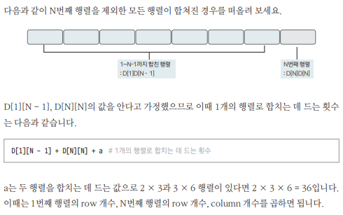
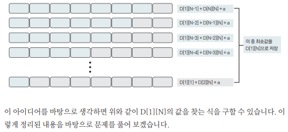

[링크](https://www.acmicpc.net/problem/11049)

## 1. 문제 분석

크기가 N * M인 행렬과 M * K인 행렬을 곱할 때 필요한 곱셈 연산 횟수는 `N * M * K`번이다.  

여러 개의 행렬을 곱할 때 필요한 곱셈 연산 횟수는 행렬을 곱하는 순서에 따라 달라진다. 

ex) 행렬 A : 5 * 3, 행렬 B : 3 * 2, 행렬 C : 2 * 6

ABC를 구하는 경우의 수

1) (AB)C
= (AB를 구할 때 필요한 곱셈 연산 횟수) + ((AB)C를 구할 때 필요한 곱셈 연산 횟수)  
= (5 * 3 * 2) + (5 * 2 * 6) = 30 + 60 = 90번

또는 

= A(BC)
= (BC를 구할 때 필요한 곱셈 연산 횟수) + (A(BC)를 구할 때 필요한 곱셈 연산 횟수)  
= (3 * 2 * 6) + (5 * 3 * 6) = 36 + 90 = 126번

이렇게 똑같은 곱셈이지만 곱셈을 하는 순서에 따라 곱셈 연산 횟수가 달라진다. 

행렬 N개의 크기가 주어졌을 때 모든 행렬을 곱하는데 필요한 곱셈 연산 횟수의 최솟값을 구하는 프로그램을 작성하시오.   
단, 입력으로 주어진 행렬의 순서를 바꾸면 안 된다.

- 행렬 개수 : 최대 500개 
- 행렬 크기 : 행과 열 최대 500

---

DP의 특징을 다시 한 번 떠올려보자.  
부분 문제를 해결해서 큰 문제를 해결하는 방식이 DP의 특징 중 하나다. 

따라서 부분 문제가 해결됐다고 가정하고 점화식을 고안하는 것이 점화식을 만드는 좋은 방법 중 하나다.

행렬 N개가 주어졌다. 1 ~ N개를 모두 곱했을 때 최소 연산 횟수를 구해야 한다.  

N을 제외한 모든 부분 영역(ex. 1~(N-1), 2~N, 3~(N-2))을 1개의 행렬로 만드는데 필요한 최소 연산 횟수를 알고 있다고 가정해보자.  
이렇게 가정하면 1 ~ N 구역의 최소 연산 횟수는 어떻게 구할 수 있을까?

- 점화식 정의 
```
D[i][j] : i ~ j 구간의 행렬을 합치는데 필요한 최소 연산 횟수
```





## 2. 손으로 풀어보기 


## 3. 슈도코드 

``` 

```

[코드](../../code/폴더/파일이름.py)