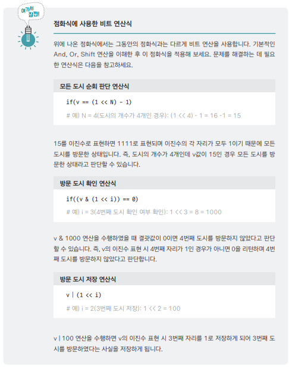
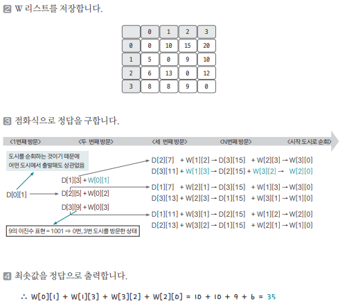

[링크](https://www.acmicpc.net/problem/2098)

## 1. 문제 분석

1 ~ N번까지 번호가 매겨진 도시들이 있고 도시들 사이에는 길이 있을 수도 있다. 

이제 한 외판원이 어느 한 도시에서 출발해 N개의 도시를 모두 거쳐 다시 원래의 도시로 돌아오는 여행 경로를 계획하려고 한다. (단, 한 번 갔던 도시로는 다시 갈 수 없다)

이 조건을 만족하는 여행 경로 중에서 가장 적은 비용을 들이는 여행 계획을 세우고자 한다. 

- W[i][j] : 도시 i -> 도시 j로 가기 위한 비용

모든 도시 간의 비용은 양의 정수이고 갈 수 없다면 W[i][j] = 0이 된다.

--- 

TSP(Traveling Salesman Problem; 외판원 순환 문제)라는 컴퓨터 과학 분야에서 가장 중요하게 취급되는 문제 

여러 응용 문제가 있지만 여기서는 가장 일반적인 형태의 문제를 살펴본다. 

N의 크기가 매우 작아서 모든 순서를 완전 탐색하면 정답을 구할 수 있다.

- 점화식
```
D[c][v] : 현재 도시 c, 현재까지 방문한 모든 도시 리스트가 v일 때 앞으로 남은 모든 도시를 경유하는데 필요한 최소 비용

ex) D[2][1, 2] : 현재 도시 2, [1, 2]를 방문한 상태에서 나머지 모든 도시를 경유하는데 필요한 최소 비용
```

여기서 생각해야 될 문제가 [1, 2]와 같은 리스트 v를 어떻게 하나의 숫자로 표현해야 할 지에 대한 내용이다. 여기서는 `2진수`를 이용해서 표현한다.

ex) 도시 개수 4개 

- 4번 도시, 1번 도시 방문 => 1001 -> D[i][9]
- 3번 도시, 2번 도시 방문 => 0110 -> D[i][6]
- 4, 3, 2, 1번 도시 방문 => 1111 -> D[15]

이렇게 `방문 도시`를 `이진수의 각 자릿수`로 표현 & 방문 시 1, 미방문 시 0으로 저장하는 방식을 사용하면 방문 리스트를 1개의 변수로 표현할 수 있다.

## 2. 손으로 풀어보기 

1. 점화식을 구한다.

c번 도시에서 v 리스트 도시를 방문한 후 남은 모든 도시를 순회하기 위한 최소 비용은 현재 방문하지 않은 모든 도시에 대해 반복하고 방문하지 않은 도시를 i라고 할 때 다음과 같다. 

W[c][i] : 도시 c -> 도시 i로 가기 위한 비용

```
D[c][v] = Math.min(D[c][v], D[i][v | (1 << i)] + W[c][i])
```





## 3. 슈도코드 

``` 
N : 도시 개수 
W[i][j] : i 도시 -> j 도시로 가는 데 필요한 비용을 저장하는 리스트

for i -> 0 ~ N : 
    W 리스트에 값 저장 

D : 현재 도시 c, 방문한 도시 리스트가 v일 때 
    남은 모든 도시를 경유하는 데 필요한 최소 비용 테이블

TSP(c, v) : 

    if 모든 도시를 방문했을 경우 : 
        시작 도시로 돌아갈 수 있을 때 : return W[c][시작 도시]

        돌아갈 수 없을 때 : return 무한대

    
    if 이미 계산한 적이 있을 때 : 
        return D[c][v]

    for i in 0 ~ N : 
        if 방문한 적이 없고 갈 수 있는 도시일 때 : 
            min_val = Math.min(min_val, tsp(i, (v | 1 << i)) + W[c][i])

    D[c][v] = min_val
    return D[c][v]

tsp(0, 1)
정답 출력 
```

[코드](../../code/day29/95_외판원순회경로.py)