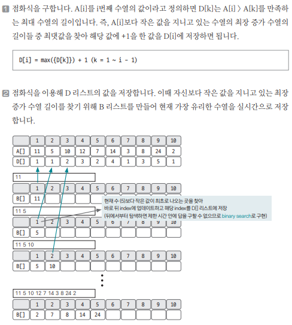
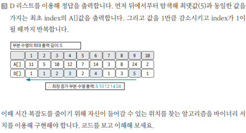

[링크](https://www.acmicpc.net/problem/14003)

## 1. 문제 분석

수열 A가 주어졌을 때 가장 길게 증가하는 부분 수열을 구하는 프로그램을 작성하시오.

ex) 수열 A = {10, 20, 10, 30, 20, 50}

가장 긴 증가하는 부분 수열은 {10, 20, 30, 50} 이고, 길이는 4이다.

---

최장 증가 수열의 점화식은 다음과 같이 비교적 간단하게 정의할 수 있다.

```
D[i] : 0 ~ i까지 i를 포함하는 가장 길게 증가하는 수열의 길이
```

부분 문제를 이용해 전체 문제를 해결하기 위해 `i값`은 `부분 문제의 핵심`이 되도록 정의해야 한다. 그래서 D[i]를 위와 같이 정의했다.

단, N의 최댓값이 1,000,000이므로 시간 복잡도를 고려해 풀이해야 한다.

## 2. 손으로 풀어보기 





## 3. 슈도코드 

``` 
N : 수열 개수 
A : 수열 데이터를 저장하는 리스트 
maxLength : 최장 증가 수열의 길이 저장 

B : 현재 가장 유리한 증가 수열을 저장하는 리스트 
D : 0 ~ i까지 i를 포함하는 최장 증가 수열의 길이를 저장하는 리스트 
ans : 정답 수열을 저장하는 리스트

binarySearch(1, r, now) : 
    while l < r : 
        중앙값 = (l + r) // 2 
        B[중앙값] < now => l값을 (중앙값 + l)로 변경
        B[중앙값] >= now => r값을 (중앙값)으로 변경

    return l

for i -> 2 ~ N :
    
    if 가장 마지막 수열보다 현재 수열이 클 때 
        B 리스트의 끝에 A[i]값 추가 
        maxLength <= maxLength + 1 
        D 리스트에 maxLength 저장 

    else : 
        바이너리 서치를 이용해 현재 수열이 들어갈 index 찾기
        B[index] <= 현재 수열의 값
        D[i] = index

최장 증가 부분 수열의 길이 출력(maxLength)

for i -> N ~ 1 : 
    최초 maxLength와 같은 값을 가진 D 리스트 index를 찾아 이 수열을 정답 리스트에 저장

    maxLength -= 1 

정답 리스트 출력
``` 

[코드](../../code/day29/96_최장증가수열찾기.py)
