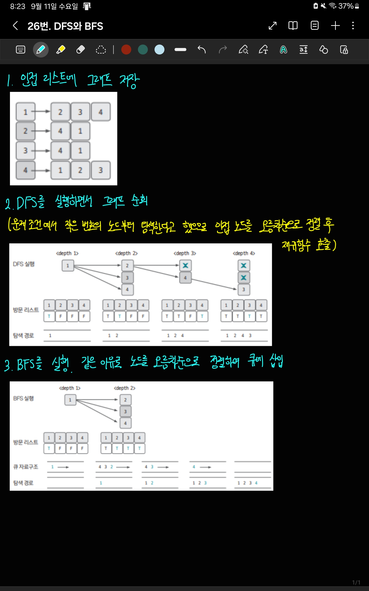

[백준 링크](https://www.acmicpc.net/problem/1260)

1. 문제 분석 

말 그대로 그래프를 DFS, BFS를 이용해 해결하는 문제다. 

2. 손으로 풀어보기 



3. 슈도코드 작성하기 

```
N = 노드 개수 
M = edge 개수 
start = 그래프의 시작점 
A = 그래프 데이터를 저장할 인접 리스트 

for i in range(M) : 
    인접 리스트 A에 그래프 데이터 저장 

def DFS(현재 노드) : 

    print(현재 노드)
    visited[현재 노드] = True 

    for 이웃노드 in A[현재노드] : 

        if visited[이웃 노드] == False : 
            DFS(이웃 노드)

visited 리스트 초기화 

DFS(start) # dfs 시작 

def BFS(현재 노드) : 

    que.enqueue(현재 노드)
    visited[현재노드] = True

    while que.isEmpty() : 

        노드 = que.pop()
        print(노드)

        for 이웃노드 in A[노드] : 

            if visited[이웃노드] == False : 
                que.append(이웃노드)

visited 리스트 초기화 
BFS(start) 실행 
```

4. 코드 

[코드](../code/026_BFS와DFS.py)