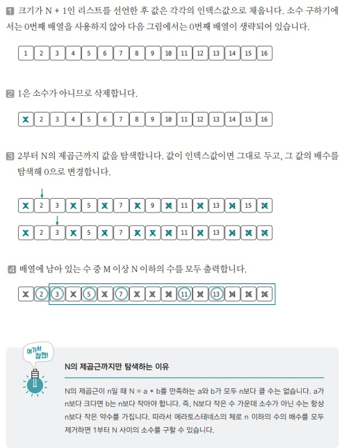

[백준 링크](https://www.acmicpc.net/problem/1929)

1. 문제 분석

주어진 숫자 사이에 `소수를 출력`하는 문제다. 

N의 최대값은 100만이므로 일반적인 소수 구하기 방식으로 문제를 풀면 시간초과가 발생한다.  
여기서 말하는 `일반적인 소수 구하기 방식`은 2 이상부터 자기 자신보다 작은 수를 하나씩 나눴을 때 모든 식의 결과의 나머지가 0이 아닌 숫자를 찾는 방식이다. 

따라서, `에라토스테네스 방식`을 이용해 문제를 풀어야 한다.

2. 손으로 풀어보기



3. 슈도코드 작성

```
M, N = 입력값 

A = 소수 리스트 

for N만큼 반복 : 
    A 리스트 초기화

for N의 제곱근까지 반복 : 
    소수가 아니면 넘어간다.
    for 소수의 배수값을 N까지 반복 : 
        현재 숫자가 소수가 아니라는 것을 표시한다.

for M ~ N까지 반복 : 
    A에서 소수인 값 출력
```

4. 코드 

[코드](../code/037_소수구하기.py)