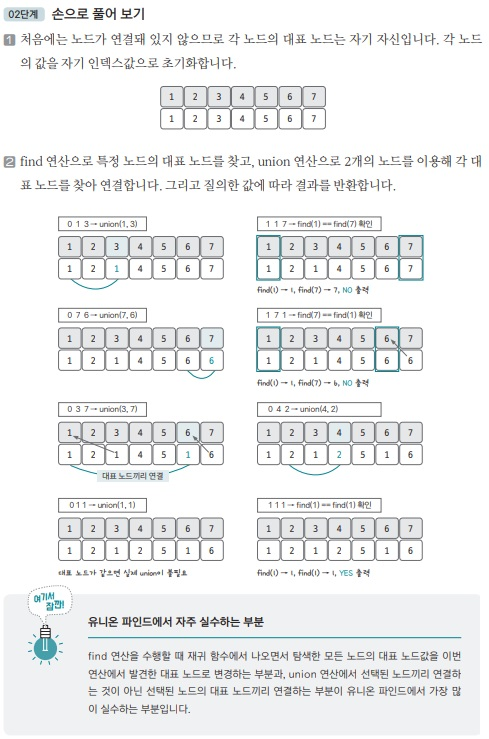

[백준 링크](https://www.acmicpc.net/problem/1717)

1. 문제 분석

- 최대 원소 개수 : 100만개 
- 최대 질의 개수 : 10만게 

개수가 큰 편이므로 `경로 압축`이 필요한 `Union-Find 문제`이다. 

** Union-Find란? 

일반적으로 여러 노드가 있을 때 

- Union 연산 : 특정 2개의 노드를 연결해 1개의 집합으로 묶는 연산
- Find 연산 : 두 노드가 같은 집합에 속해 있는지를 확인하는 연산

으로 구성된 알고리즘 

2. 손으로 풀어보기



- `0 1 3` : `1번 노드`와 `3번 노드`의 대표노드를 찾아 연결(union)
- `1 1 7` : `1번 노드의 대표 노드`와 `7번 노드의 대표 노드`를 찾아 둘이 서로 같은지를 확인한다. (`find(1) == find(7)`)

이후의 과정도 똑같이 진행한다. 

3. 슈도코드 작성

```
N = 원소 개수
M = 질의 개수 

parent = 대표 노드를 저장할 리스트 

# 리스트 초기화 
for i in range(1, N+1) : 
    parent[i] = i

find(a) : 
    if a == 대표노드 : 
        return a
    
    else : 
        a의 대표 노드 값을 find(parent[a])값으로 저장


union(a, b) : 

    a의 대표 노드 = find(a)
    b의 대표 노드 = find(b)

    union(a의 대표 노드, b의 대표 노드)

checkSame(a, b) : 

    a의 대표 노드 = find(a)
    b의 대표 노드 = find(b)

    if "a의 대표 노드" == "b의 대표 노드" : 
        return true 
    
    else : 
        return false

for i in range(M) : 
    if 질의 == 0 : 
        집합 합치기 

    else : 
        같은 집합 원소인지 확인하고 결과값 출력

```

4. 코드 

[코드](../code/)