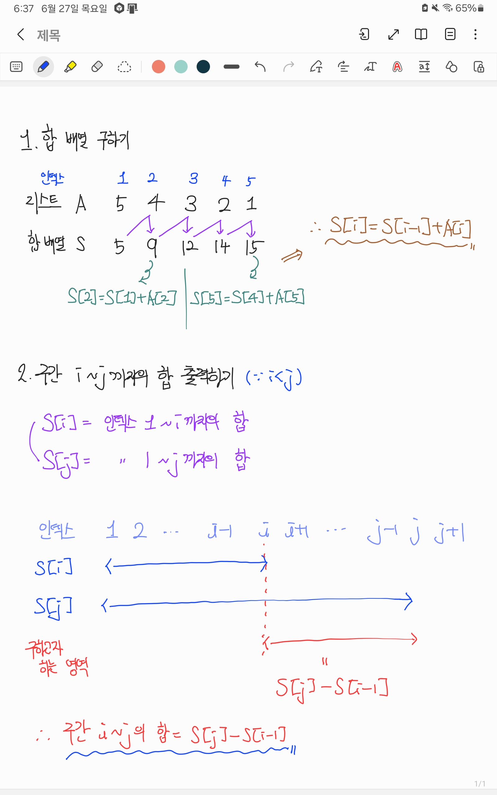

[백준 링크](https://www.acmicpc.net/problem/11659)

1단계. 문제 분석 

- 문제 조건을 먼저 살펴보자.
    - 숫자의 개수 N = 최대값 10만 
    - 합을 구하는 회수 M = 최대값 10만 

따라서, 주어진 구간마다 매번 계산한다면 최악의 경우 `1억 회 이상의 연산`을 수행하게 된다.  
그래서 `1초 이상의 수행 시간`이 필요하다. 

이럴 때 바로 `구간 합`을 이용해야 한다. 

2단계. 손으로 풀어보기 

1. 주어진 리스트를 가지고 `합 배열`을 생성
2. 주어진 구간에 따라 구간 합을 구하는 공식으로 정답 출력 



3단계. 슈도코드 

``` python
N = 숫자개수 
M = 질의개수 

numbers = [숫자 데이터 저장]

prefix_sum = [] # 합 배열 변수 선언 

temp # 변수 

# 합 배열 구하기 
for ~~

# 질의 개수 만큼 반복
for ~ : 
    주어진 구간 범위 받고 
    그 구간가지고 곧바로 구간 합 출력

```

4단계. [코드 구현](../code/003_구간합구하기.py)
