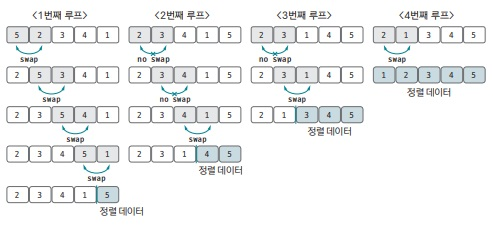

[백준 링크](https://www.acmicpc.net/problem/2750)

1. 문제 분석 

Python에서는 `sort() 함수`를 이용해 쉽게 정렬할 수 있지만 정렬을 직접 구현해서 문제를 해결해보자. 

- N의 최대 범위가 1000으로 매우 작다.
- 그래서 `O(n^2) 시간 복잡도` 알고리즘을 사용할 수 있다. 
- `버블 정렬`의 시간 복잡도가 `O(n^2)`이므로 버블 정렬을 사용해도 시간안에 문제를 해결할 수 있다. 

2. 손으로 풀어 보기 



3. 슈도코드 작성하기 

``` 
N = 정렬할 데이터 개수 
A = 데이터 저장할 리스트 및 주어진 입력 데이터 저장 

for i in range(N-1) : 
    for j in range(N-1-i) : 
        if A[j] > A[j+1] : 
            A[j]와 A[j+1] 바꾸기

A 리스트 출력 
```

4. 코드 

[코드](../code/015_수정렬하기1.py)