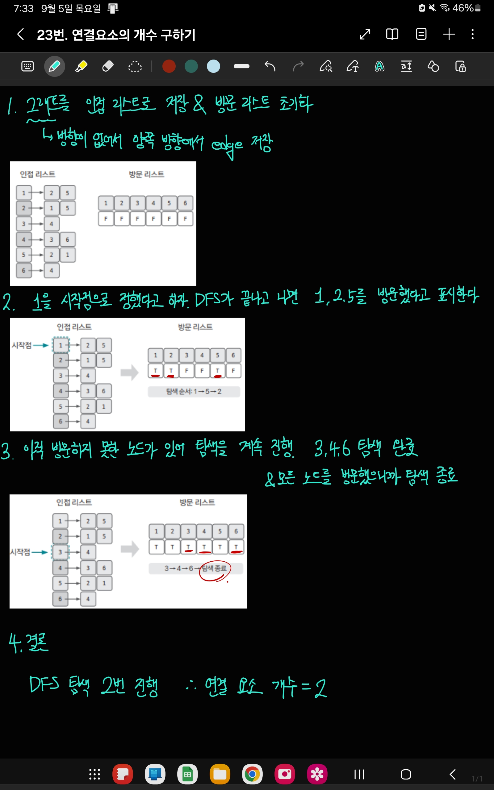

[백준 링크](https://www.acmicpc.net/problem/11724)

1. 문제 분석 

노드의 최대 개수 = 1000 ⇒ 시간 복잡도 N^2 이하의 알고리즘 사용가능 

- `연결 요소` : edge로 연결된 노드의 집합  
=> 때문에 한 번의 DFS가 끝날 때 탐색한 모든 노드의 집합을 하나의 연결 요소로 판단할 수 있다

2. 손으로 풀어보기 



3. 슈도코드 작성 

``` 
n = 노드개수
m = 엣지 개수 

A = 그래프를 저장할 인접 리스트
visited = 방문 기록 리스트 

def DFS(현재 노드) : 

    # 현재 노드에 방문 
    visited[현재 노드] = true

    # 현재 노드와 이웃한 노드 중에서 
    for 이웃 노드 in A[노드] : 

        # 아직 이웃 노드를 방문하지 않았다면 
        if visited[이웃 노드] == false : 
            DFS(이웃노드) # dfs 실행 

# 엣지 개수만큼 반복 
for i in range(m) : 
    인접 리스트 A에 데이터 저장

for i in range(n) : 
    if 방문하지 않은 노드가 있는 경우
        연결 요소 개수 1 증가 
        DFS 실행

print(연결 요소 개수)
```

4. 코드 

[코드](../code/023_연결요소의개수구하기.py)