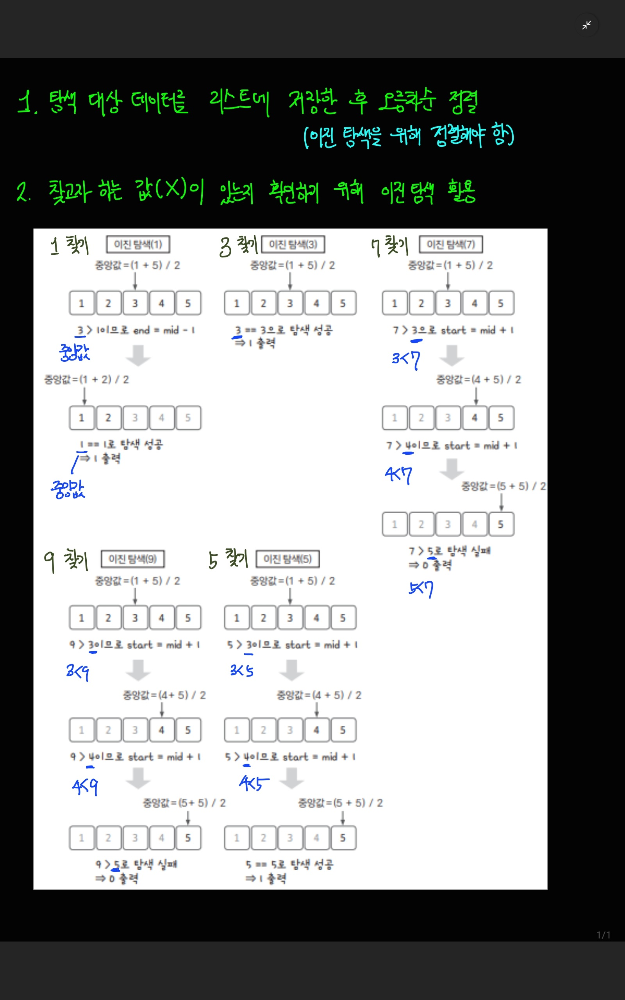

[백준 링크](https://www.acmicpc.net/problem/1920)

1. 문제 분석 

- N의 최대값은 10만
    - 그래서 단순 반복문으로는 이 문제를 풀 수 없다.
    - `이진 탐색`을 사용하려면 데이터를 정렬해야 하는데 `O(nlogn)` 시간 복잡도로 해결할 수 있다.

그래서 `이진 탐색`을 적용하려고 한다. 

2. 손으로 풀어 보기 



3. 슈도코드 작성하기 

```
N = 숫자 개수
A = 숫자 데이터 저장하는 리스트
A 리스트 정렬 

M = 탐색할 숫자 개수 저장 
target_list = 탐색할 숫자 데이터 리스트 저장 

# 탐색 시작 
for i in range(M)

    target = target_list[i]

    start = 시작 인덱스 
    end = 마지막 인덱스 

    while start <= end : 

        mid_index = 중간 인덱스
        mid_value = 중간 값 

        if mid_value > target : 
            end = mid_index - 1 # 범위를 왼쪽으로 좁힘
            

        elif mid_value < target : 
            start = mid_index + 1 # 범위를 오른쪽으로 좁힙 

        else : 
            break # 찾았음. 반복문 종료 

    if 값을 찾았음 : 
        print(1)

    else : 
        print(0)
```

4. 코드 

[코드](../code/029_원하는정수찾기.py)