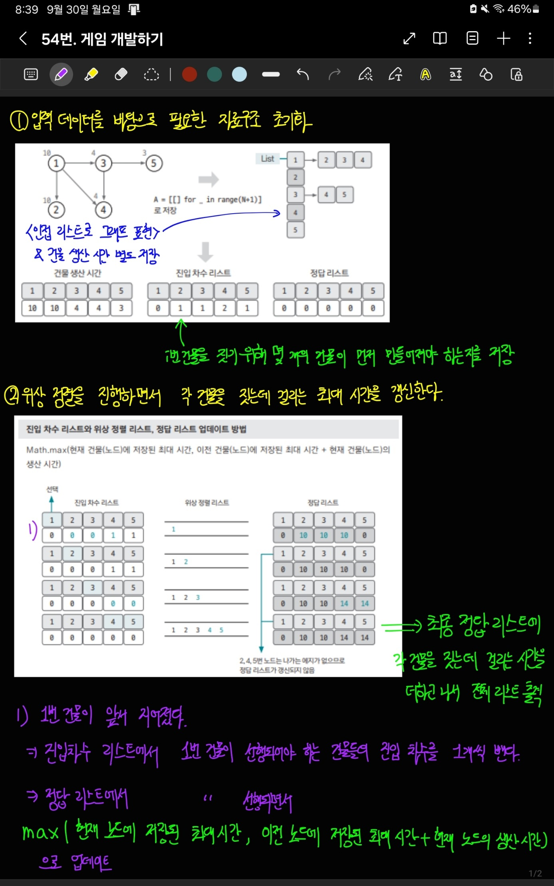

[백준 링크](https://www.acmicpc.net/problem/1516)

1. 문제 분석

예제를 먼저 파악해보면 아래와 같은 내용이다. 

1번째 줄 : `10 -1` ⇒ `1번 건물`을 짓는데 걸리는 시간이 10 / 먼저 지어야 하는 건물 : 없음 

2번째 줄 : `10 1 -1` ⇒ `2번 건물`을 짓는데 걸리는 시간이 10 / 먼저 지어야 하는 건물 : 1번 건물 

3번째 줄 : `4 1 -1` ⇒ `3번 건물`을 짓는데 걸리는 시간이 4 / 먼저 지저야 하는 건물 : 1번 건물 

... 반복 ...

이 문제를 풀기 위해서는 `어떤 건물을 짓기 위해 먼저 지어야 하는 건물이 있을 수 있다`는 문장에 주목해야 한다. 

각 건물을 `노드`라고 생각하면 그래프의 형태에서 `노드 순서를 정렬`하는 알고리즘인 `위상 정렬`을 사용해야 한다는 걸 알 수 있다. 

최대 건물 수 500개 / 시간 복잡도 2초 => 시간 제한 부담은 없다. 

2. 손으로 풀어보기



3. 슈도코드 작성

```


```

4. 코드 

[코드](../code/)